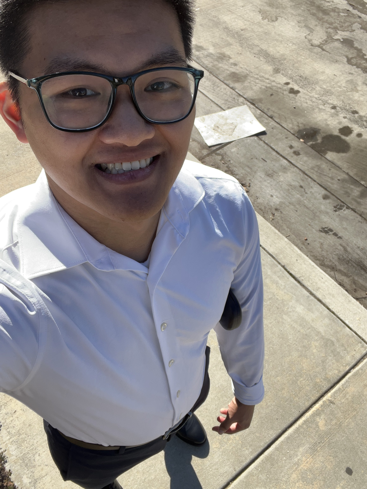

# Newton Chung 

Hello! I'm a third year Math-CS major who went from straight A's to "C's get degrees".

[About me](https://github.com/NewtonLC/CSE110/edit/main/index.md#about-me)

[Past projects](https://github.com/NewtonLC/CSE110/edit/main/index.md#past-projects)

[Other experience](https://github.com/NewtonLC/CSE110/edit/main/index.md#other-experience)

## About Me

I'd consider myself an alright programmer, but I don't have any SE experience, which is why I enrolled in CSE 110.
As a teammate, I am patient and flexible, and I like to maintain steady communication in my team. Though I wanted to gain experience in programming,
I'm really starting to see that SE involves much more, so I'm just looking to fill whatever roles my team will need.

You can find me in the **VGDC** or **CSForEach**, or if you're taking **MATH 103B** with Yunze Lu or **LIHL 118** this quarter. *My discord username is "skit.s"*

I'm not sure how to incorporate ordered and unordered lists in a natural way so here are my favorite conventional ice cream flavors.
1. Cookies and Cream
2. Cookie Dough
3. Cotton Candy

Hobbies:
- Playing video games with friends & family
- Running/Hiking
- Baking

TODO:
- [ ] Quit procrastinating
- [ ] Start sleeping earlier(not past midnight)
- [ ] Make flossing a habit
- [ ] Figure out life
- [x] Eat oreos

## Past Projects

TODO: Go over some of your past projects
- Picture
- Small description of the project to a CS audience (in quote)
  - Add links to the projects' itch.io pages? 
- Explain my role

### OLANA, Unity project

> This is a game project that I worked on in a group of 5.

I contributed to programming and slightly in design. I became more familiar with Github, Unity, and just working with a team through building this project.

## Other Experience

TODO: CSForEach, US Cyber Initiative
- Pic of company/orgnization logo
- Small description of what organization is about (in quote)
  - Add links to the orgs' main sites? 
- Explain what I've done in these positions
