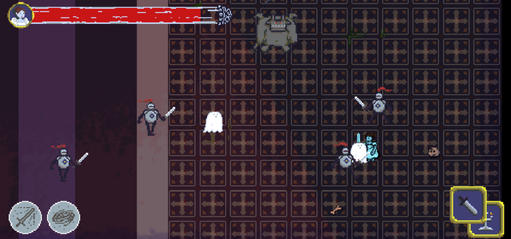

# Newton Chung 

Hello! I'm a third year Math-CS major who went from straight A's to "C's get degrees".

[About me](https://github.com/NewtonLC/CSE110/edit/main/index.md#about-me)

[Past experience](https://github.com/NewtonLC/CSE110/edit/main/index.md#past-experience)

## About Me

I'd consider myself an alright programmer, but I don't have any SE experience, which is why I enrolled in CSE 110.
As a teammate, I am patient and flexible, and I like to maintain steady communication in my team. Though I wanted to gain experience in programming,
I'm really starting to see that SE involves much more, so I'm just looking to fill whatever roles my team will need.

You can find me in **MATH 103B** with Yunze Lu or **LIHL 118** this quarter, or if you have Discord. My Discord username is "skit.s"

I'm also a member in VGDC and CSForEach!

I'm not sure how to incorporate ordered and unordered lists in a natural way so here are my favorite conventional ice cream flavors.
1. Cookies and Cream
2. Cookie Dough
3. Cotton Candy

Hobbies:
- Playing video games with friends & family
- Running/Hiking
- Baking

TODO:
- [ ] Quit procrastinating
- [ ] Start sleeping earlier(not past midnight)
- [ ] Make flossing a habit
- [ ] Figure out life
- [x] **_Eat oreos_**

## Past Experience

### OLANA, Unity project

> This is a game project that I worked on in a group of 5 in VGDC. It's an arcade-style endless survival game that currently is only available on [itch.io](https://newtonlc.itch.io/olana). I programmed several key features and helped coordinate the project with my team, becoming more familiar with Github and Unity in the process. I gained some experience with group projects and communication, but it seems like it'll be different from CSE 110 in many ways.

### CSForEach Curriculum Member

> [Click to learn more about CSFE](https://www.csforeach.org/). As a curriculum member, I've been able to help build and present a few workshops throughout Winter quarter. I also plan to help in TritonHacks in May.

### Assistant Bootcamp Instructor

> Originally AZ Cyber Initiative, they expanded to focus on students throughout the US. [Here's their website!](https://azcyber.org/) During this internship, I worked part-time alongside a group of instructors and presented modules from [TryHackMe.com](https://tryhackme.com/) to high school students.
